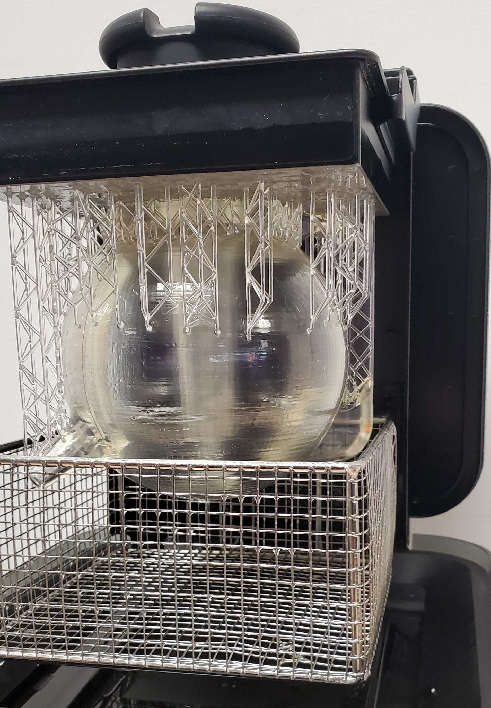

# Puzzle-Pot

This 3D model was created by John Shull on behalf of Professor Ann Kumm for her Technical and Scientific Writing class [(ENGL 231C)](https://catalog.odu.edu/courses/engl/) held at [Old Dominion University](https://www.odu.edu) starting in the fall of 2021. Her class covers sections from [Don Norman's 'The Design of Everyday things.'](https://jnd.org/the-design-of-everyday-things-revised-and-expanded-edition/)

## About the Model

This model is based on the puzzle-pot concept that was originally designed by the Chinese hundreds of years ago. This is an original take on the design and was scaled so it could be printed on a majority of 3D desktop printers - the original scale was to fit within 7in x 5in x 5in (w * h * d) cube. This particular design, like the other puzzle-pots, has a hollow section to it and in some cases is best for printing on a resin based printer - but it should also work for other printers just be aware of the added support during slicing might be hard to remove! We used a [FormLabs Form 2](https://formlabs.com/store/3d-printers/form-2/) with the clear resin as you can see some of the images below. There are two versions included here, the first version is what we've printed for the class use, the second version was based on some feedback from the handle and we got a little more carried away with the design :smile:

You can find the model formats in the [first release here](https://github.com/JShull/PuzzlePot/releases/tag/v1.0.0)!

### Version 1

* 
* 
* 
* 
* 

### Version 2

* 
* 

## Model Formats

We have included both *.STL and *.OBJ versions of the model as well as an archived version of the Fusion360 file. This was one of my first 360 Fusion files - hence no naming or good practices were used - use at your own free will! See the release for all of the model files and reference images.

## Contact

[John Shull](mailto:the.john.shull@gmail.com?subject=Puzzle-Pot-Questions!)
